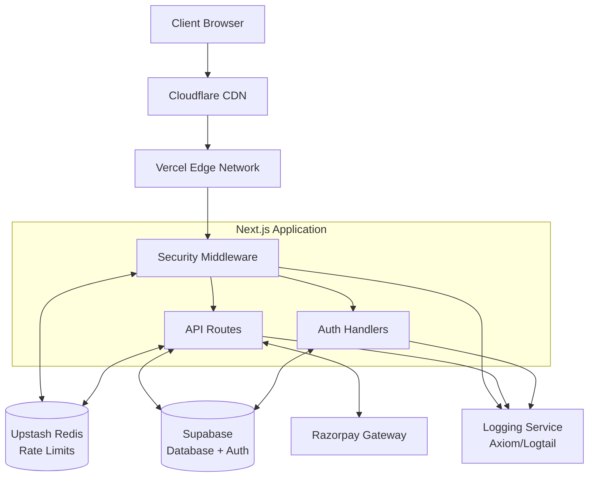

# Security Hardening & Infrastructure — Design Document

**Feature:** Comprehensive security hardening and production-ready infrastructure
**Status:** Draft
**Created:** 2026-06-21

---

## Overview

This design implements a comprehensive security hardening strategy for the Vimala Silk House e-commerce platform. The solution addresses critical vulnerabilities through distributed rate limiting, authentication hardening, API security middleware, payment verification, security headers, and monitoring infrastructure. The architecture is designed for Vercel's serverless platform with Upstash Redis for distributed state and Supabase for database and authentication.

### Key Components

1. **Distributed Rate Limiting** — Redis-backed rate limiting with sliding window algorithm
2. **Authentication Security** — OTP hardening, session management, and account protection
3. **API Security Middleware** — Request validation, authentication, and authorization
4. **Payment Security** — Webhook signature verification and replay prevention
5. **Security Headers** — CSP, HSTS, and other protective headers
6. **Monitoring & Logging** — Comprehensive security event logging and alerting
7. **Database Security** — RLS policy review and enforcement

---

## Architecture

### System Architecture Diagram



### Technology Stack

- **Runtime:** Next.js 14+ (App Router) on Vercel
- **Rate Limiting:** Upstash Redis with `@upstash/ratelimit`
- **Database:** Supabase PostgreSQL with RLS
- **Auth:** Supabase Auth with custom OTP flow
- **Payment:** Razorpay with webhook verification
- **Logging:** Axiom or Logtail for structured logs
- **Monitoring:** Vercel Analytics + Custom metrics
- **CDN:** Cloudflare for DDoS protection

---

## Components and Interfaces

### 1. Distributed Rate Limiting System


#### 1.1 Rate Limiter Interface

```typescript
interface RateLimitConfig {
  maxRequests: number;
  windowMs: number;
  identifier: string; // IP, user ID, email, etc.
  limitType: 'sliding' | 'fixed';
}

interface RateLimitResult {
  success: boolean;
  limit: number;
  remaining: number;
  reset: number; // Unix timestamp
  retryAfter?: number; // Seconds until retry
}

interface RateLimiter {
  check(config: RateLimitConfig): Promise<RateLimitResult>;
  reset(identifier: string): Promise<void>;
  getMetrics(): Promise<RateLimitMetrics>;
}
```

#### 1.2 Implementation Strategy

**Upstash Redis Integration:**
- Use `@upstash/ratelimit` library with sliding window algorithm
- Configuration via environment variables:
  - `UPSTASH_REDIS_REST_URL`
  - `UPSTASH_REDIS_REST_TOKEN`
- Separate limiters for different endpoint types

**Rate Limit Tiers:**

```typescript
const RATE_LIMITS = {
  // Authentication endpoints
  OTP_REQUEST_PER_EMAIL: { max: 3, window: 15 * 60 * 1000 }, // 3 per 15 min
  OTP_REQUEST_PER_IP: { max: 10, window: 60 * 60 * 1000 },   // 10 per hour
  OTP_VERIFY_PER_EMAIL: { max: 3, window: 10 * 60 * 1000 },  // 3 per 10 min
  LOGIN_PER_IP: { max: 5, window: 15 * 60 * 1000 },          // 5 per 15 min
  
  // API endpoints
  API_PER_IP: { max: 100, window: 60 * 1000 },               // 100 per minute
  API_PER_USER: { max: 60, window: 60 * 1000 },              // 60 per minute
  
  // Payment endpoints
  PAYMENT_WEBHOOK: { max: 100, window: 60 * 1000 },          // 100 per minute
  
  // Admin endpoints
  ADMIN_PER_USER: { max: 120, window: 60 * 1000 },           // 120 per minute
};
```

#### 1.3 Middleware Integration

```typescript
// middleware.ts
export async function middleware(request: NextRequest) {
  const path = request.nextUrl.pathname;
  
  // Rate limit by path pattern
  if (path.startsWith('/api/auth/otp')) {
    const email = await getEmailFromRequest(request);
    const ip = getClientIP(request);
    
    // Check both email and IP limits
    const [emailLimit, ipLimit] = await Promise.all([
      rateLimiter.check({
        identifier: `otp:email:${email}`,
        maxRequests: 3,
        windowMs: 15 * 60 * 1000,
        limitType: 'sliding'
      }),
      rateLimiter.check({
        identifier: `otp:ip:${ip}`,
        maxRequests: 10,
        windowMs: 60 * 60 * 1000,
        limitType: 'sliding'
      })
    ]);
    
    if (!emailLimit.success || !ipLimit.success) {
      return rateLimitResponse(emailLimit.success ? ipLimit : emailLimit);
    }
  }
  
  return NextResponse.next();
}
```

---

### 2. Authentication Security System


#### 2.1 OTP Generation and Management

**Cryptographically Secure OTP:**

```typescript
interface OTPRecord {
  code: string;
  email: string;
  expiresAt: Date;
  attempts: number;
  createdAt: Date;
  ipAddress: string;
}

function generateSecureOTP(): string {
  // Use crypto.randomInt for cryptographically secure random
  const otp = crypto.randomInt(100000, 999999).toString();
  return otp;
}

async function createOTP(email: string, ip: string): Promise<OTPRecord> {
  const code = generateSecureOTP();
  const expiresAt = new Date(Date.now() + 10 * 60 * 1000); // 10 minutes
  
  const record = await supabase
    .from('otp_codes')
    .insert({
      code: await hashOTP(code), // Store hashed
      email,
      expires_at: expiresAt,
      attempts: 0,
      ip_address: ip
    })
    .select()
    .single();
    
  return { ...record, code }; // Return plaintext for email
}
```

**OTP Verification with Attempt Tracking:**

```typescript
async function verifyOTP(email: string, code: string, ip: string): Promise<VerificationResult> {
  const record = await supabase
    .from('otp_codes')
    .select('*')
    .eq('email', email)
    .gt('expires_at', new Date())
    .order('created_at', { ascending: false })
    .limit(1)
    .single();
    
  if (!record) {
    await logSecurityEvent('otp_not_found', { email, ip });
    return { success: false, reason: 'OTP_NOT_FOUND' };
  }
  
  if (record.attempts >= 3) {
    await logSecurityEvent('otp_max_attempts', { email, ip });
    return { success: false, reason: 'MAX_ATTEMPTS_EXCEEDED' };
  }
  
  const isValid = await verifyHashedOTP(code, record.code);
  
  if (!isValid) {
    await supabase
      .from('otp_codes')
      .update({ attempts: record.attempts + 1 })
      .eq('id', record.id);
      
    await logSecurityEvent('otp_invalid', { email, ip, attempts: record.attempts + 1 });
    return { success: false, reason: 'INVALID_CODE' };
  }
  
  // Mark OTP as used
  await supabase.from('otp_codes').delete().eq('id', record.id);
  
  return { success: true };
}
```

#### 2.2 Session Management

**Secure Cookie Configuration:**

```typescript
const SESSION_COOKIE_OPTIONS = {
  httpOnly: true,
  secure: process.env.NODE_ENV === 'production',
  sameSite: 'lax' as const,
  maxAge: 7 * 24 * 60 * 60, // 7 days
  path: '/',
};

async function createSession(userId: string, response: NextResponse) {
  const session = await supabase.auth.getSession();
  
  response.cookies.set('sb-access-token', session.access_token, SESSION_COOKIE_OPTIONS);
  response.cookies.set('sb-refresh-token', session.refresh_token, {
    ...SESSION_COOKIE_OPTIONS,
    maxAge: 30 * 24 * 60 * 60, // 30 days
  });
}
```

**Session Rotation on Privilege Escalation:**

```typescript
async function elevateSession(userId: string, newRole: string): Promise<void> {
  // Invalidate old session
  await supabase.auth.signOut();
  
  // Create new session with updated role
  const { data, error } = await supabase.auth.signInWithPassword({
    email: user.email,
    password: temporaryToken, // Or use admin API
  });
  
  // Update user role
  await supabase.rpc('set_user_role', { user_id: userId, role: newRole });
  
  await logSecurityEvent('session_elevated', { userId, newRole });
}
```

#### 2.3 Account Lockout Protection

```typescript
interface FailedAttemptRecord {
  identifier: string; // email or IP
  count: number;
  firstAttempt: Date;
  lockedUntil?: Date;
}

async function checkAccountLockout(email: string, ip: string): Promise<LockoutStatus> {
  const [emailAttempts, ipAttempts] = await Promise.all([
    getFailedAttempts(`email:${email}`),
    getFailedAttempts(`ip:${ip}`)
  ]);
  
  if (emailAttempts.count >= 5 && !isLockoutExpired(emailAttempts.lockedUntil)) {
    return { locked: true, reason: 'EMAIL_LOCKED', unlockAt: emailAttempts.lockedUntil };
  }
  
  if (ipAttempts.count >= 10 && !isLockoutExpired(ipAttempts.lockedUntil)) {
    return { locked: true, reason: 'IP_LOCKED', unlockAt: ipAttempts.lockedUntil };
  }
  
  return { locked: false };
}

async function recordFailedAttempt(email: string, ip: string): Promise<void> {
  const attempts = await incrementFailedAttempts(`email:${email}`);
  
  if (attempts >= 5) {
    const lockDuration = 15 * 60 * 1000; // 15 minutes
    await lockAccount(`email:${email}`, lockDuration);
    await sendSecurityAlert({ type: 'account_locked', email, attempts });
  }
}
```

---

### 3. API Security Middleware Stack


#### 3.1 Request Validation Layer

**Zod Schema Validation:**

```typescript
import { z } from 'zod';

// Example schemas
const CreateOrderSchema = z.object({
  items: z.array(z.object({
    productId: z.string().uuid(),
    quantity: z.number().int().positive().max(100),
    variant: z.string().optional(),
  })).min(1).max(50),
  shippingAddress: z.object({
    name: z.string().min(2).max(100),
    phone: z.string().regex(/^[6-9]\d{9}$/),
    addressLine1: z.string().min(5).max(200),
    city: z.string().min(2).max(100),
    state: z.string().min(2).max(100),
    pincode: z.string().regex(/^\d{6}$/),
  }),
  paymentMethod: z.enum(['razorpay', 'cod']),
});

// Validation middleware
function validateRequest<T extends z.ZodType>(schema: T) {
  return async (req: NextRequest) => {
    try {
      const body = await req.json();
      const validated = schema.parse(body);
      return { valid: true, data: validated };
    } catch (error) {
      if (error instanceof z.ZodError) {
        return { valid: false, errors: error.errors };
      }
      throw error;
    }
  };
}
```

**Sanitization Functions:**

```typescript
function sanitizeString(input: string): string {
  // Remove potential XSS vectors
  return input
    .replace(/[<>]/g, '') // Remove angle brackets
    .replace(/javascript:/gi, '') // Remove javascript: protocol
    .trim()
    .substring(0, 1000); // Max length
}

function sanitizeSearchQuery(query: string): string {
  // Prevent SQL injection in LIKE queries
  return query
    .replace(/[%_\\]/g, '\\$&') // Escape LIKE wildcards
    .replace(/[\x00-\x1F\x7F]/g, '') // Remove control characters
    .trim();
}
```

#### 3.2 Authentication Middleware

```typescript
interface AuthContext {
  user: User | null;
  isAuthenticated: boolean;
  role: UserRole;
}

async function requireAuth(request: NextRequest): Promise<AuthContext | Response> {
  const token = request.cookies.get('sb-access-token')?.value;
  
  if (!token) {
    return new Response(JSON.stringify({ error: 'Unauthorized' }), {
      status: 401,
      headers: { 'Content-Type': 'application/json' }
    });
  }
  
  const { data: { user }, error } = await supabase.auth.getUser(token);
  
  if (error || !user) {
    await logSecurityEvent('auth_failed', { token: token.slice(0, 10), error });
    return new Response(JSON.stringify({ error: 'Invalid token' }), {
      status: 401,
      headers: { 'Content-Type': 'application/json' }
    });
  }
  
  return {
    user,
    isAuthenticated: true,
    role: user.user_metadata?.role || 'customer'
  };
}

async function requireRole(allowedRoles: UserRole[], request: NextRequest): Promise<AuthContext | Response> {
  const authResult = await requireAuth(request);
  
  if (authResult instanceof Response) {
    return authResult;
  }
  
  if (!allowedRoles.includes(authResult.role)) {
    await logSecurityEvent('authorization_failed', {
      userId: authResult.user?.id,
      requiredRoles: allowedRoles,
      actualRole: authResult.role
    });
    
    return new Response(JSON.stringify({ error: 'Forbidden' }), {
      status: 403,
      headers: { 'Content-Type': 'application/json' }
    });
  }
  
  return authResult;
}
```

#### 3.3 Request Size and Timeout Limits

```typescript
const API_LIMITS = {
  MAX_REQUEST_SIZE: 1024 * 1024, // 1MB
  MAX_FILE_SIZE: 5 * 1024 * 1024, // 5MB
  REQUEST_TIMEOUT: 30000, // 30 seconds
  MAX_QUERY_PARAMS: 50,
};

async function enforceRequestLimits(request: NextRequest): Promise<Response | null> {
  // Check request size
  const contentLength = request.headers.get('content-length');
  if (contentLength && parseInt(contentLength) > API_LIMITS.MAX_REQUEST_SIZE) {
    return new Response(JSON.stringify({ error: 'Request too large' }), {
      status: 413,
      headers: { 'Content-Type': 'application/json' }
    });
  }
  
  // Check query param count
  const params = request.nextUrl.searchParams;
  if (Array.from(params.keys()).length > API_LIMITS.MAX_QUERY_PARAMS) {
    return new Response(JSON.stringify({ error: 'Too many parameters' }), {
      status: 400,
      headers: { 'Content-Type': 'application/json' }
    });
  }
  
  return null;
}
```

---

### 4. Payment Security Implementation


#### 4.1 Razorpay Webhook Verification

```typescript
import crypto from 'crypto';

interface RazorpayWebhook {
  event: string;
  payload: {
    payment: {
      entity: PaymentEntity;
    };
  };
  created_at: number;
}

async function verifyRazorpaySignature(
  request: NextRequest
): Promise<{ valid: boolean; payload?: RazorpayWebhook }> {
  const signature = request.headers.get('x-razorpay-signature');
  const webhookSecret = process.env.RAZORPAY_WEBHOOK_SECRET;
  
  if (!signature || !webhookSecret) {
    await logSecurityEvent('webhook_missing_signature', {});
    return { valid: false };
  }
  
  const body = await request.text();
  
  // Verify signature
  const expectedSignature = crypto
    .createHmac('sha256', webhookSecret)
    .update(body)
    .digest('hex');
  
  if (signature !== expectedSignature) {
    await logSecurityEvent('webhook_invalid_signature', {
      receivedSignature: signature.slice(0, 10),
      expectedSignature: expectedSignature.slice(0, 10)
    });
    return { valid: false };
  }
  
  const payload = JSON.parse(body) as RazorpayWebhook;
  
  // Check timestamp to prevent replay attacks
  const eventAge = Date.now() - payload.created_at * 1000;
  if (eventAge > 5 * 60 * 1000) { // 5 minutes
    await logSecurityEvent('webhook_replay_detected', {
      eventAge: eventAge / 1000,
      createdAt: payload.created_at
    });
    return { valid: false };
  }
  
  return { valid: true, payload };
}
```

#### 4.2 Idempotency Key Enforcement

```typescript
interface PaymentProcessingRecord {
  idempotencyKey: string;
  orderId: string;
  status: 'processing' | 'completed' | 'failed';
  createdAt: Date;
  completedAt?: Date;
}

async function processPaymentWithIdempotency(
  idempotencyKey: string,
  orderId: string,
  processFn: () => Promise<void>
): Promise<ProcessingResult> {
  // Check if already processed
  const existing = await redis.get(`idempotency:${idempotencyKey}`);
  
  if (existing) {
    const record = JSON.parse(existing) as PaymentProcessingRecord;
    
    if (record.status === 'completed') {
      return { success: true, duplicate: true };
    }
    
    if (record.status === 'processing') {
      // Still processing, return 409 Conflict
      return { success: false, reason: 'ALREADY_PROCESSING' };
    }
  }
  
  // Mark as processing
  await redis.setex(
    `idempotency:${idempotencyKey}`,
    3600, // 1 hour TTL
    JSON.stringify({
      idempotencyKey,
      orderId,
      status: 'processing',
      createdAt: new Date()
    })
  );
  
  try {
    await processFn();
    
    // Mark as completed
    await redis.setex(
      `idempotency:${idempotencyKey}`,
      86400, // 24 hours TTL
      JSON.stringify({
        idempotencyKey,
        orderId,
        status: 'completed',
        createdAt: new Date(),
        completedAt: new Date()
      })
    );
    
    return { success: true, duplicate: false };
  } catch (error) {
    // Mark as failed
    await redis.setex(
      `idempotency:${idempotencyKey}`,
      3600,
      JSON.stringify({
        idempotencyKey,
        orderId,
        status: 'failed',
        createdAt: new Date()
      })
    );
    
    throw error;
  }
}
```

#### 4.3 Payment Data Security

**Razorpay Checkout Integration (No card storage):**

```typescript
// Client-side: Use Razorpay hosted checkout
function initiatePayment(orderId: string, amount: number) {
  const options = {
    key: process.env.NEXT_PUBLIC_RAZORPAY_KEY_ID, // Public key only
    amount: amount * 100, // Paise
    currency: 'INR',
    name: 'Vimala Silk House',
    order_id: orderId,
    handler: async (response: RazorpayResponse) => {
      // Send only payment ID to backend, never card details
      await fetch('/api/payment/verify', {
        method: 'POST',
        body: JSON.stringify({
          orderId: response.razorpay_order_id,
          paymentId: response.razorpay_payment_id,
          signature: response.razorpay_signature
        })
      });
    },
  };
  
  const rzp = new Razorpay(options);
  rzp.open();
}

// Server-side: Verify without accessing card data
async function verifyPayment(
  orderId: string,
  paymentId: string,
  signature: string
): Promise<VerificationResult> {
  const secret = process.env.RAZORPAY_KEY_SECRET;
  
  const expectedSignature = crypto
    .createHmac('sha256', secret)
    .update(`${orderId}|${paymentId}`)
    .digest('hex');
  
  if (signature !== expectedSignature) {
    await logSecurityEvent('payment_verification_failed', {
      orderId,
      paymentId: paymentId.slice(0, 10)
    });
    return { valid: false };
  }
  
  return { valid: true };
}
```

---

### 5. Security Headers Configuration


#### 5.1 Security Headers Implementation

```typescript
const SECURITY_HEADERS = {
  // Content Security Policy
  'Content-Security-Policy': [
    "default-src 'self'",
    "script-src 'self' 'unsafe-inline' 'unsafe-eval' https://checkout.razorpay.com",
    "style-src 'self' 'unsafe-inline' https://fonts.googleapis.com",
    "img-src 'self' data: https: blob:",
    "font-src 'self' https://fonts.gstatic.com",
    "connect-src 'self' https://*.supabase.co https://api.razorpay.com",
    "frame-src https://api.razorpay.com",
    "object-src 'none'",
    "base-uri 'self'",
    "form-action 'self'",
    "frame-ancestors 'none'",
    "upgrade-insecure-requests"
  ].join('; '),
  
  // Prevent clickjacking
  'X-Frame-Options': 'DENY',
  
  // Prevent MIME sniffing
  'X-Content-Type-Options': 'nosniff',
  
  // XSS protection (legacy browsers)
  'X-XSS-Protection': '1; mode=block',
  
  // HTTPS enforcement
  'Strict-Transport-Security': 'max-age=31536000; includeSubDomains; preload',
  
  // Control referrer information
  'Referrer-Policy': 'strict-origin-when-cross-origin',
  
  // Permissions policy
  'Permissions-Policy': [
    'camera=()',
    'microphone=()',
    'geolocation=()',
    'interest-cohort=()'
  ].join(', '),
};

// Apply in middleware or next.config.js
export function applySecurityHeaders(response: NextResponse): NextResponse {
  Object.entries(SECURITY_HEADERS).forEach(([key, value]) => {
    response.headers.set(key, value);
  });
  
  return response;
}
```

#### 5.2 Next.js Configuration

```typescript
// next.config.js
const securityHeaders = [
  {
    key: 'X-DNS-Prefetch-Control',
    value: 'on'
  },
  {
    key: 'X-Frame-Options',
    value: 'DENY'
  },
  {
    key: 'X-Content-Type-Options',
    value: 'nosniff'
  },
  {
    key: 'Referrer-Policy',
    value: 'strict-origin-when-cross-origin'
  },
  {
    key: 'Permissions-Policy',
    value: 'camera=(), microphone=(), geolocation=()'
  }
];

module.exports = {
  async headers() {
    return [
      {
        source: '/:path*',
        headers: securityHeaders,
      },
    ];
  },
};
```

---

### 6. Monitoring and Logging Infrastructure


#### 6.1 Structured Logging System

```typescript
interface SecurityEvent {
  timestamp: Date;
  eventType: SecurityEventType;
  severity: 'low' | 'medium' | 'high' | 'critical';
  userId?: string;
  ipAddress: string;
  userAgent?: string;
  details: Record<string, any>;
  endpoint?: string;
}

type SecurityEventType =
  | 'auth_failed'
  | 'rate_limit_exceeded'
  | 'otp_invalid'
  | 'otp_max_attempts'
  | 'account_locked'
  | 'webhook_invalid_signature'
  | 'webhook_replay_detected'
  | 'payment_verification_failed'
  | 'authorization_failed'
  | 'suspicious_activity';

class SecurityLogger {
  private client: AxiomClient; // or Logtail, Datadog, etc.
  
  async log(event: SecurityEvent): Promise<void> {
    // Send to logging service
    await this.client.ingest('security-events', [
      {
        ...event,
        environment: process.env.NODE_ENV,
        service: 'vimala-silk-house',
      }
    ]);
    
    // Check if alert needed
    if (event.severity === 'critical' || this.shouldAlert(event)) {
      await this.sendAlert(event);
    }
  }
  
  private shouldAlert(event: SecurityEvent): boolean {
    // Alert logic based on event frequency
    if (event.eventType === 'auth_failed') {
      return this.getRecentFailedLogins(event.ipAddress) >= 5;
    }
    
    if (event.eventType === 'rate_limit_exceeded') {
      return this.getRecentRateLimits(event.ipAddress) >= 10;
    }
    
    return false;
  }
  
  private async sendAlert(event: SecurityEvent): Promise<void> {
    // Send to alerting channels (email, Slack, PagerDuty)
    await Promise.all([
      this.sendEmailAlert(event),
      this.sendSlackAlert(event)
    ]);
  }
}

// Global instance
export const securityLogger = new SecurityLogger();

// Usage
await securityLogger.log({
  timestamp: new Date(),
  eventType: 'auth_failed',
  severity: 'medium',
  ipAddress: clientIP,
  details: { email, reason: 'invalid_otp' }
});
```

#### 6.2 Real-time Alerting Rules

```typescript
interface AlertRule {
  name: string;
  condition: (events: SecurityEvent[]) => boolean;
  window: number; // milliseconds
  threshold: number;
  severity: 'low' | 'medium' | 'high' | 'critical';
  actions: AlertAction[];
}

const ALERT_RULES: AlertRule[] = [
  {
    name: 'Multiple Failed Logins',
    condition: (events) => events.filter(e => e.eventType === 'auth_failed').length >= 5,
    window: 5 * 60 * 1000, // 5 minutes
    threshold: 5,
    severity: 'high',
    actions: ['email', 'slack']
  },
  {
    name: 'Webhook Signature Failures',
    condition: (events) => events.filter(e => e.eventType === 'webhook_invalid_signature').length >= 3,
    window: 60 * 1000, // 1 minute
    threshold: 3,
    severity: 'critical',
    actions: ['email', 'slack', 'pagerduty']
  },
  {
    name: 'Mass Rate Limiting',
    condition: (events) => events.filter(e => e.eventType === 'rate_limit_exceeded').length >= 100,
    window: 60 * 1000, // 1 minute
    threshold: 100,
    severity: 'high',
    actions: ['email', 'slack']
  },
  {
    name: 'Account Lockouts',
    condition: (events) => events.filter(e => e.eventType === 'account_locked').length >= 10,
    window: 10 * 60 * 1000, // 10 minutes
    threshold: 10,
    severity: 'medium',
    actions: ['email']
  }
];

class AlertingEngine {
  private eventBuffer: Map<string, SecurityEvent[]> = new Map();
  
  async processEvent(event: SecurityEvent): Promise<void> {
    // Add to buffer
    const key = `${event.eventType}:${event.ipAddress}`;
    const events = this.eventBuffer.get(key) || [];
    events.push(event);
    this.eventBuffer.set(key, events);
    
    // Check all rules
    for (const rule of ALERT_RULES) {
      const relevantEvents = events.filter(e => 
        Date.now() - e.timestamp.getTime() < rule.window
      );
      
      if (rule.condition(relevantEvents)) {
        await this.triggerAlert(rule, event);
      }
    }
    
    // Cleanup old events
    this.cleanupBuffer();
  }
  
  private async triggerAlert(rule: AlertRule, event: SecurityEvent): Promise<void> {
    const alert = {
      ruleName: rule.name,
      severity: rule.severity,
      event,
      timestamp: new Date()
    };
    
    for (const action of rule.actions) {
      switch (action) {
        case 'email':
          await this.sendEmailAlert(alert);
          break;
        case 'slack':
          await this.sendSlackAlert(alert);
          break;
        case 'pagerduty':
          await this.sendPagerDutyAlert(alert);
          break;
      }
    }
  }
}
```

#### 6.3 Metrics Dashboard

```typescript
interface SecurityMetrics {
  rateLimitHits: number;
  failedLogins: number;
  successfulLogins: number;
  otpRequests: number;
  otpFailures: number;
  webhookVerifications: number;
  webhookFailures: number;
  activeUsers: number;
  requestsByEndpoint: Record<string, number>;
  topIPs: Array<{ ip: string; count: number }>;
}

async function getSecurityMetrics(timeRange: TimeRange): Promise<SecurityMetrics> {
  // Query from logging service or Redis
  const events = await securityLogger.query({
    from: timeRange.start,
    to: timeRange.end,
    types: ['auth_failed', 'rate_limit_exceeded', 'otp_invalid']
  });
  
  return {
    rateLimitHits: events.filter(e => e.eventType === 'rate_limit_exceeded').length,
    failedLogins: events.filter(e => e.eventType === 'auth_failed').length,
    successfulLogins: await getSuccessfulLoginCount(timeRange),
    otpRequests: await getOTPRequestCount(timeRange),
    otpFailures: events.filter(e => e.eventType === 'otp_invalid').length,
    webhookVerifications: await getWebhookCount(timeRange),
    webhookFailures: events.filter(e => e.eventType === 'webhook_invalid_signature').length,
    activeUsers: await getActiveUserCount(timeRange),
    requestsByEndpoint: await getRequestsByEndpoint(timeRange),
    topIPs: await getTopIPs(timeRange, 10)
  };
}
```

---

### 7. Database Security (Supabase RLS)


#### 7.1 RLS Policy Review Checklist

**Tables Requiring RLS:**
- `orders` — Customer can only see their own orders
- `addresses` — Customer can only see their own addresses
- `reviews` — Public read, authenticated write
- `wishlist` — Customer can only see their own wishlist
- `cart` — Customer can only see their own cart
- `customers` — Customer can only see/update their own profile
- `admin_logs` — Admin-only access

**RLS Policy Patterns:**

```sql
-- Pattern 1: User owns the record
CREATE POLICY "Users can view their own orders"
ON orders FOR SELECT
USING (auth.uid() = customer_id);

-- Pattern 2: Admin access
CREATE POLICY "Admins can view all orders"
ON orders FOR SELECT
USING (
  EXISTS (
    SELECT 1 FROM user_roles
    WHERE user_id = auth.uid()
    AND role = 'admin'
  )
);

-- Pattern 3: Public read, authenticated write
CREATE POLICY "Anyone can view products"
ON products FOR SELECT
USING (true);

CREATE POLICY "Only admins can modify products"
ON products FOR ALL
USING (
  EXISTS (
    SELECT 1 FROM user_roles
    WHERE user_id = auth.uid()
    AND role IN ('admin', 'manager')
  )
);

-- Pattern 4: Conditional access
CREATE POLICY "Users can view their own or public reviews"
ON reviews FOR SELECT
USING (
  is_public = true
  OR auth.uid() = user_id
);
```

#### 7.2 RLS Gaps and Fixes

**Current Gaps to Address:**

1. **Orders Table** — Missing policy for order updates
```sql
-- Fix: Add update policy
CREATE POLICY "Users can update their pending orders"
ON orders FOR UPDATE
USING (
  auth.uid() = customer_id
  AND status IN ('pending', 'awaiting_payment')
)
WITH CHECK (
  auth.uid() = customer_id
  AND status IN ('pending', 'awaiting_payment')
);
```

2. **Addresses Table** — No RLS enabled
```sql
-- Fix: Enable RLS and add policies
ALTER TABLE addresses ENABLE ROW LEVEL SECURITY;

CREATE POLICY "Users can manage their own addresses"
ON addresses FOR ALL
USING (auth.uid() = customer_id)
WITH CHECK (auth.uid() = customer_id);
```

3. **Admin Routes Using Service Role** — Bypass RLS unsafely
```typescript
// Current (UNSAFE):
const { data } = await supabaseAdmin // Service role bypasses RLS
  .from('orders')
  .select('*');

// Fix: Use authenticated client with role check
const { data } = await supabase // Uses RLS
  .from('orders')
  .select('*');

// Admin check in application code
if (userRole !== 'admin') {
  throw new Error('Unauthorized');
}
```

4. **OTP Codes Table** — No RLS policies
```sql
-- Fix: Add policies
ALTER TABLE otp_codes ENABLE ROW LEVEL SECURITY;

CREATE POLICY "Users can view their own OTP codes"
ON otp_codes FOR SELECT
USING (auth.jwt() ->> 'email' = email);

CREATE POLICY "System can insert OTP codes"
ON otp_codes FOR INSERT
WITH CHECK (true); -- Controlled by application logic
```

#### 7.3 Service Role Usage Audit

**Minimize Service Role Usage:**

Service role should ONLY be used for:
- Initial setup and migrations
- Background jobs that need cross-user access
- Admin operations with explicit permission checks

**Replace Service Role with User Context:**

```typescript
// Before (INSECURE):
async function getOrderDetails(orderId: string) {
  const { data } = await supabaseAdmin // Bypasses RLS!
    .from('orders')
    .select('*')
    .eq('id', orderId)
    .single();
  return data;
}

// After (SECURE):
async function getOrderDetails(orderId: string, userId: string) {
  const { data } = await supabase // Uses RLS
    .from('orders')
    .select('*')
    .eq('id', orderId)
    .eq('customer_id', userId) // Explicit filter
    .single();
  return data;
}
```

#### 7.4 RLS Testing Strategy

```typescript
// Test helper
async function testRLSPolicy(
  table: string,
  operation: 'select' | 'insert' | 'update' | 'delete',
  userId: string,
  shouldSucceed: boolean
) {
  const supabase = createClientForUser(userId);
  
  try {
    const result = await supabase.from(table)[operation]({ /* data */ });
    
    if (shouldSucceed && result.error) {
      throw new Error(`RLS policy too restrictive: ${result.error.message}`);
    }
    
    if (!shouldSucceed && !result.error) {
      throw new Error('RLS policy too permissive: operation should have failed');
    }
  } catch (error) {
    if (!shouldSucceed) {
      return; // Expected failure
    }
    throw error;
  }
}

// Example tests
describe('Orders RLS Policies', () => {
  it('should allow users to view their own orders', async () => {
    await testRLSPolicy('orders', 'select', 'user-123', true);
  });
  
  it('should prevent users from viewing other users orders', async () => {
    await testRLSPolicy('orders', 'select', 'user-456', false);
  });
  
  it('should allow admins to view all orders', async () => {
    await testRLSPolicy('orders', 'select', 'admin-user', true);
  });
});
```

---

## Data Models


### Security-Related Tables

#### OTP Codes Table

```sql
CREATE TABLE otp_codes (
  id UUID PRIMARY KEY DEFAULT gen_random_uuid(),
  email TEXT NOT NULL,
  code_hash TEXT NOT NULL, -- Hashed OTP
  expires_at TIMESTAMPTZ NOT NULL,
  attempts INT DEFAULT 0,
  ip_address INET,
  created_at TIMESTAMPTZ DEFAULT NOW(),
  used_at TIMESTAMPTZ,
  CONSTRAINT valid_attempts CHECK (attempts >= 0 AND attempts <= 3)
);

CREATE INDEX idx_otp_email ON otp_codes(email);
CREATE INDEX idx_otp_expires ON otp_codes(expires_at);
```

#### Security Events Table

```sql
CREATE TABLE security_events (
  id UUID PRIMARY KEY DEFAULT gen_random_uuid(),
  event_type TEXT NOT NULL,
  severity TEXT NOT NULL CHECK (severity IN ('low', 'medium', 'high', 'critical')),
  user_id UUID REFERENCES auth.users(id),
  ip_address INET,
  user_agent TEXT,
  endpoint TEXT,
  details JSONB,
  created_at TIMESTAMPTZ DEFAULT NOW()
);

CREATE INDEX idx_security_events_type ON security_events(event_type);
CREATE INDEX idx_security_events_created ON security_events(created_at);
CREATE INDEX idx_security_events_severity ON security_events(severity);
CREATE INDEX idx_security_events_ip ON security_events(ip_address);
```

#### Failed Login Attempts Table

```sql
CREATE TABLE failed_login_attempts (
  id UUID PRIMARY KEY DEFAULT gen_random_uuid(),
  identifier TEXT NOT NULL, -- email or IP
  attempt_count INT DEFAULT 1,
  first_attempt_at TIMESTAMPTZ DEFAULT NOW(),
  last_attempt_at TIMESTAMPTZ DEFAULT NOW(),
  locked_until TIMESTAMPTZ,
  CONSTRAINT positive_count CHECK (attempt_count > 0)
);

CREATE UNIQUE INDEX idx_failed_attempts_identifier ON failed_login_attempts(identifier);
```

#### User Roles Table

```sql
CREATE TABLE user_roles (
  id UUID PRIMARY KEY DEFAULT gen_random_uuid(),
  user_id UUID NOT NULL REFERENCES auth.users(id) ON DELETE CASCADE,
  role TEXT NOT NULL CHECK (role IN ('customer', 'admin', 'manager', 'support')),
  granted_by UUID REFERENCES auth.users(id),
  granted_at TIMESTAMPTZ DEFAULT NOW(),
  UNIQUE(user_id, role)
);

CREATE INDEX idx_user_roles_user ON user_roles(user_id);
```

---

Now I need to use the prework tool before writing the Correctness Properties section.


## Correctness Properties

*A property is a characteristic or behavior that should hold true across all valid executions of a system—essentially, a formal statement about what the system should do. Properties serve as the bridge between human-readable specifications and machine-verifiable correctness guarantees.*

### Rate Limiting Properties

**Property 1: Rate limit enforcement**
*For any* rate-limited endpoint, email, or IP address, when the configured request limit is exceeded within the time window, subsequent requests should be rejected with a 429 status code and appropriate retry-after header.
**Validates: Requirements 1.1, 1.2, 1.4, 4.2, 4.3**

**Property 2: Sliding window accuracy**
*For any* sequence of requests across a window boundary, the rate limiter should count requests within a sliding time window, not a fixed window, ensuring that bursts at window edges don't bypass limits.
**Validates: Requirements 4.2**

### Authentication Properties

**Property 3: OTP format and randomness**
*For any* generated OTP code, it should be exactly 6 digits, contain only numeric characters, and exhibit uniform distribution across generation (no predictable patterns).
**Validates: Requirements 2.1**

**Property 4: OTP expiration**
*For any* OTP code, verification attempts after 10 minutes from creation should be rejected with an expiration error.
**Validates: Requirements 2.2**

**Property 5: OTP attempt limiting**
*For any* OTP code, after 3 failed verification attempts, subsequent verification attempts should be rejected regardless of the code provided.
**Validates: Requirements 2.3**

**Property 6: Account lockout enforcement**
*For any* email or IP address, after 5 failed verification attempts, subsequent authentication attempts should be blocked until the lockout period expires.
**Validates: Requirements 2.5**

**Property 7: Secure cookie attributes**
*For any* session cookie set by the authentication system, it should have httpOnly=true, sameSite=lax, and (in production) secure=true attributes.
**Validates: Requirements 3.1, 3.3**

**Property 8: Session invalidation on logout**
*For any* authenticated session, after logout is called, all subsequent requests using that session token should be rejected with 401 Unauthorized.
**Validates: Requirements 3.5**

### API Security Properties

**Property 9: Input validation enforcement**
*For any* API endpoint with a defined Zod schema, requests with invalid payloads (wrong types, missing required fields, out-of-range values) should be rejected with 400 Bad Request and detailed validation errors.
**Validates: Requirements 5.1**

**Property 10: File upload validation**
*For any* file upload endpoint, files exceeding size limits or with invalid MIME types should be rejected before processing.
**Validates: Requirements 5.4**

**Property 11: Request size limiting**
*For any* API request, payloads exceeding the configured maximum size should be rejected with 413 Payload Too Large.
**Validates: Requirements 5.5**

**Property 12: Authentication requirement enforcement**
*For any* protected API route, requests without a valid JWT token should be rejected with 401 Unauthorized.
**Validates: Requirements 6.1**

**Property 13: Role-based authorization**
*For any* endpoint requiring specific roles (admin, manager), requests from authenticated users without the required role should be rejected with 403 Forbidden.
**Validates: Requirements 6.2, 6.3, 6.4**

### Payment Security Properties

**Property 14: Webhook signature verification**
*For any* Razorpay webhook request, those with invalid or missing signatures should be rejected and logged as security events.
**Validates: Requirements 7.1**

**Property 15: Webhook replay prevention**
*For any* webhook request with a timestamp older than 5 minutes, it should be rejected to prevent replay attacks.
**Validates: Requirements 7.4**

**Property 16: Idempotency enforcement**
*For any* payment processing request with a duplicate idempotency key, it should return the cached result without re-processing the payment.
**Validates: Requirements 7.5**

**Property 17: Payment log sanitization**
*For any* payment-related log entry, it should not contain full card numbers, CVV codes, or other sensitive payment details.
**Validates: Requirements 8.4**

### Security Headers Properties

**Property 18: Security headers presence**
*For any* HTTP response from the application, it should include all required security headers: Content-Security-Policy, X-Frame-Options, X-Content-Type-Options, Strict-Transport-Security (in production), Referrer-Policy, and Permissions-Policy with correct values.
**Validates: Requirements 9.1, 9.2, 9.3, 9.4, 9.5, 9.6**

### Database Security Properties

**Property 19: Row-level security enforcement**
*For any* customer querying the orders table, only orders where customer_id matches the authenticated user's ID should be returned.
**Validates: Requirements 11.2**

**Property 20: Admin table access control**
*For any* admin-only table query by a non-admin user, the result set should be empty or the query should be rejected.
**Validates: Requirements 11.3**

### Logging Properties

**Property 21: Security event logging**
*For any* security-relevant event (failed login, rate limit hit, payment verification failure, admin action), a structured log entry should be created with timestamp, event type, user ID (if applicable), IP address, and relevant details.
**Validates: Requirements 2.4, 12.1, 12.2, 12.3, 12.4**

### Metrics Properties

**Property 22: Success rate calculation accuracy**
*For any* set of payment verification attempts, the calculated success rate should equal (successful verifications / total verifications) × 100.
**Validates: Requirements 14.3**

**Property 23: Error rate tracking**
*For any* API endpoint, the calculated error rate should equal (error responses / total responses) × 100 for that endpoint.
**Validates: Requirements 14.4**

---

## Error Handling


### Error Response Format

All security-related errors should follow a consistent format:

```typescript
interface SecurityErrorResponse {
  error: {
    code: string;
    message: string;
    details?: Record<string, any>;
    timestamp: string;
  };
  retryAfter?: number; // For rate limiting
}

// Examples:
{
  error: {
    code: 'RATE_LIMIT_EXCEEDED',
    message: 'Too many requests. Please try again later.',
    details: {
      limit: 3,
      window: 900,
      identifier: 'email:user@example.com'
    },
    timestamp: '2024-01-15T10:30:00Z'
  },
  retryAfter: 600
}

{
  error: {
    code: 'INVALID_OTP',
    message: 'The OTP code is invalid or has expired.',
    details: {
      attemptsRemaining: 2
    },
    timestamp: '2024-01-15T10:30:00Z'
  }
}

{
  error: {
    code: 'UNAUTHORIZED',
    message: 'Authentication required.',
    timestamp: '2024-01-15T10:30:00Z'
  }
}
```

### Error Categories

1. **Authentication Errors (401)**
   - `UNAUTHORIZED` — Missing or invalid token
   - `TOKEN_EXPIRED` — JWT token has expired
   - `INVALID_OTP` — OTP verification failed
   - `OTP_EXPIRED` — OTP has expired
   - `ACCOUNT_LOCKED` — Too many failed attempts

2. **Authorization Errors (403)**
   - `FORBIDDEN` — Insufficient permissions
   - `ROLE_REQUIRED` — Specific role required
   - `RESOURCE_FORBIDDEN` — Cannot access resource

3. **Rate Limiting Errors (429)**
   - `RATE_LIMIT_EXCEEDED` — Too many requests
   - Include `Retry-After` header with seconds until reset

4. **Validation Errors (400)**
   - `VALIDATION_ERROR` — Input validation failed
   - `INVALID_REQUEST` — Malformed request
   - `FILE_TOO_LARGE` — Upload exceeds size limit

5. **Payment Errors (400/500)**
   - `WEBHOOK_INVALID_SIGNATURE` — Signature verification failed
   - `PAYMENT_VERIFICATION_FAILED` — Payment could not be verified
   - `IDEMPOTENCY_CONFLICT` — Duplicate idempotency key

### Error Logging Strategy

```typescript
async function handleSecurityError(
  error: SecurityError,
  request: NextRequest
): Promise<Response> {
  // Log the error
  await securityLogger.log({
    timestamp: new Date(),
    eventType: mapErrorToEventType(error),
    severity: determineSeverity(error),
    ipAddress: getClientIP(request),
    userAgent: request.headers.get('user-agent') || undefined,
    endpoint: request.nextUrl.pathname,
    details: {
      errorCode: error.code,
      errorMessage: error.message
    }
  });
  
  // Check if alert needed
  if (shouldAlertOnError(error)) {
    await sendSecurityAlert(error, request);
  }
  
  // Return user-friendly error
  return new Response(
    JSON.stringify({
      error: {
        code: error.code,
        message: sanitizeErrorMessage(error.message),
        timestamp: new Date().toISOString()
      }
    }),
    {
      status: error.statusCode,
      headers: {
        'Content-Type': 'application/json',
        ...(error.retryAfter && {
          'Retry-After': error.retryAfter.toString()
        })
      }
    }
  );
}
```

### Graceful Degradation

When external services (Redis, Supabase, logging) are unavailable:

1. **Redis Down:**
   - Fall back to in-memory rate limiting (less accurate but maintains service)
   - Log degraded state
   - Alert operations team

2. **Supabase Down:**
   - Return 503 Service Unavailable
   - Enable maintenance mode
   - Cache recent data if possible

3. **Logging Service Down:**
   - Buffer logs locally (up to memory limit)
   - Continue processing requests
   - Alert operations team

```typescript
async function rateLimitWithFallback(config: RateLimitConfig): Promise<RateLimitResult> {
  try {
    return await redisRateLimiter.check(config);
  } catch (error) {
    await logger.error('Redis unavailable, falling back to in-memory rate limiter', { error });
    return await memoryRateLimiter.check(config);
  }
}
```

---

## Testing Strategy

### Dual Testing Approach

This feature requires both **unit tests** and **property-based tests** for comprehensive coverage:

- **Unit tests** verify specific examples, edge cases, and error conditions
- **Property tests** verify universal properties across randomized inputs
- Both approaches are complementary and necessary

### Property-Based Testing Configuration

**Library:** `fast-check` for TypeScript/JavaScript

**Configuration:**
- Minimum 100 iterations per property test
- Each test tagged with feature name and property number
- Tag format: `Feature: security-hardening, Property {N}: {property description}`

**Example Property Test Structure:**

```typescript
import fc from 'fast-check';

describe('Security Hardening Properties', () => {
  // Feature: security-hardening, Property 1: Rate limit enforcement
  it('should enforce rate limits across any sequence of requests', async () => {
    await fc.assert(
      fc.asyncProperty(
        fc.emailAddress(), // Random email
        fc.array(fc.date(), { minLength: 5, maxLength: 10 }), // Random request times
        async (email, requestTimes) => {
          // Test implementation
          const results = [];
          for (const time of requestTimes) {
            const result = await rateLimiter.check({
              identifier: `email:${email}`,
              maxRequests: 3,
              windowMs: 15 * 60 * 1000
            });
            results.push(result);
          }
          
          // Within 15 min window, max 3 should succeed
          const withinWindow = results.filter((r, i) => 
            requestTimes[i] - requestTimes[0] < 15 * 60 * 1000
          );
          const succeeded = withinWindow.filter(r => r.success);
          expect(succeeded.length).toBeLessThanOrEqual(3);
        }
      ),
      { numRuns: 100 }
    );
  });
});
```

### Unit Testing Strategy

**Focus Areas:**
- Edge cases (boundary values, empty inputs)
- Specific error scenarios
- Integration points between components
- Configuration handling

**Example Unit Tests:**

```typescript
describe('OTP Security', () => {
  it('should reject OTP after exactly 10 minutes', async () => {
    const otp = await createOTP('test@example.com', '192.168.1.1');
    
    // Fast-forward 10 minutes + 1 second
    jest.advanceTimersByTime(10 * 60 * 1000 + 1000);
    
    const result = await verifyOTP('test@example.com', otp.code, '192.168.1.1');
    expect(result.success).toBe(false);
    expect(result.reason).toBe('OTP_EXPIRED');
  });
  
  it('should lock account after exactly 5 failed attempts', async () => {
    const email = 'test@example.com';
    
    // Make 5 failed attempts
    for (let i = 0; i < 5; i++) {
      await verifyOTP(email, 'wrong', '192.168.1.1');
    }
    
    // 6th attempt should be blocked
    const result = await verifyOTP(email, 'wrong', '192.168.1.1');
    expect(result.success).toBe(false);
    expect(result.reason).toBe('ACCOUNT_LOCKED');
  });
});
```

### Integration Testing

**Critical Integration Points:**
1. Rate limiter ↔ Redis
2. Authentication ↔ Supabase
3. Payment verification ↔ Razorpay
4. Logging ↔ Axiom/Logtail
5. RLS policies ↔ Supabase

**Integration Test Examples:**

```typescript
describe('Redis Rate Limiter Integration', () => {
  it('should persist rate limits across service restarts', async () => {
    const email = 'test@example.com';
    
    // Make 3 requests
    for (let i = 0; i < 3; i++) {
      await rateLimiter.check({
        identifier: `email:${email}`,
        maxRequests: 3,
        windowMs: 15 * 60 * 1000
      });
    }
    
    // Simulate service restart
    await disconnectRedis();
    await connectRedis();
    
    // 4th request should still be rate limited
    const result = await rateLimiter.check({
      identifier: `email:${email}`,
      maxRequests: 3,
      windowMs: 15 * 60 * 1000
    });
    
    expect(result.success).toBe(false);
  });
});
```

### Security Testing

**OWASP Top 10 Coverage:**
1. **Broken Access Control:** RLS policy tests, RBAC tests
2. **Cryptographic Failures:** OTP generation tests, JWT verification tests
3. **Injection:** Input validation tests, SQL parameterization tests
4. **Insecure Design:** Architecture review (manual)
5. **Security Misconfiguration:** Security headers tests, environment config tests
6. **Vulnerable Components:** Dependency scanning (automated)
7. **Authentication Failures:** OTP tests, session tests, rate limiting tests
8. **Integrity Failures:** Webhook signature tests, idempotency tests
9. **Logging Failures:** Security event logging tests
10. **SSRF:** Input validation on URLs (if applicable)

### Performance Testing

**Load Testing Scenarios:**
- Rate limiter performance under high load
- Authentication throughput
- Database query performance with RLS
- Webhook processing capacity

**Acceptance Criteria:**
- p99 latency < 100ms for API endpoints
- Rate limiter overhead < 10ms
- 1000 req/sec capacity per endpoint

---

## Deployment Considerations

### Environment Variables

**Required Environment Variables:**

```bash
# Upstash Redis
UPSTASH_REDIS_REST_URL=https://...
UPSTASH_REDIS_REST_TOKEN=...

# Supabase
NEXT_PUBLIC_SUPABASE_URL=https://...
NEXT_PUBLIC_SUPABASE_ANON_KEY=...
SUPABASE_SERVICE_ROLE_KEY=... # Minimize usage

# Razorpay
NEXT_PUBLIC_RAZORPAY_KEY_ID=rzp_live_...
RAZORPAY_KEY_SECRET=... # Server-only
RAZORPAY_WEBHOOK_SECRET=... # Server-only

# Logging
AXIOM_TOKEN=...
AXIOM_DATASET=security-events

# Alerting
ALERT_EMAIL=security@vimalasilkhouse.com
SLACK_WEBHOOK_URL=...

# Environment
NODE_ENV=production
```

### Vercel Configuration

```json
{
  "buildCommand": "npm run build",
  "devCommand": "npm run dev",
  "framework": "nextjs",
  "env": {
    "NEXT_PUBLIC_SUPABASE_URL": "@supabase-url",
    "NEXT_PUBLIC_RAZORPAY_KEY_ID": "@razorpay-key-id"
  },
  "regions": ["bom1"],
  "functions": {
    "api/**": {
      "maxDuration": 30,
      "memory": 1024
    }
  }
}
```

### Monitoring Setup

**Key Metrics to Monitor:**
- Rate limit hit rate
- Failed authentication rate
- API error rate by endpoint
- Payment verification success rate
- Average response time
- Database connection pool usage

**Alerting Thresholds:**
- Failed login rate > 10/minute
- Webhook verification failure rate > 5%
- API error rate > 1%
- Response time p99 > 1000ms

---

## Migration Plan

### Phase 1: Infrastructure Setup (Week 1)
1. Set up Upstash Redis
2. Configure environment variables
3. Install dependencies
4. Set up logging service

### Phase 2: Core Security (Week 2)
1. Implement rate limiting middleware
2. Harden OTP generation and verification
3. Implement secure session management
4. Add security headers

### Phase 3: API Security (Week 3)
1. Add input validation middleware
2. Implement authentication middleware
3. Add authorization checks
4. Implement payment webhook verification

### Phase 4: Monitoring & Testing (Week 4)
1. Set up security logging
2. Configure alerts
3. Write property tests
4. Audit RLS policies
5. Security review

### Phase 5: Deployment & Validation (Week 5)
1. Deploy to staging
2. Run security scans
3. Load testing
4. Deploy to production
5. Monitor for 48 hours

---

## Success Criteria

✅ All property tests pass with 100 iterations
✅ Zero authentication bypass incidents in testing
✅ Rate limiting accuracy > 99%
✅ Security headers present on all responses
✅ Payment verification success rate > 99.9%
✅ All RLS policies tested and verified
✅ Security logging captures all relevant events
✅ Alert system tested and functional
✅ Load testing shows p99 < 100ms
✅ Security scan shows zero critical vulnerabilities

---

## References

- [OWASP Top 10 2021](https://owasp.org/Top10/)
- [Upstash Rate Limiting](https://upstash.com/docs/redis/features/ratelimiting)
- [Supabase RLS Documentation](https://supabase.com/docs/guides/auth/row-level-security)
- [Next.js Security Best Practices](https://nextjs.org/docs/app/building-your-application/configuring/security-headers)
- [Razorpay Webhook Security](https://razorpay.com/docs/webhooks/validate-webhooks/)
- [fast-check Documentation](https://fast-check.dev/)
